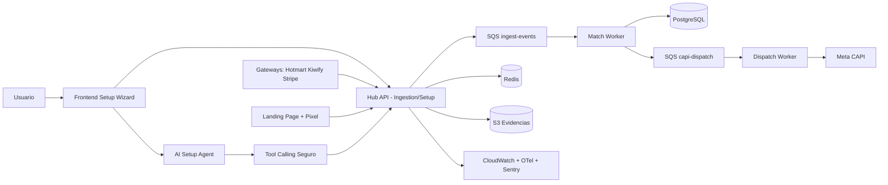
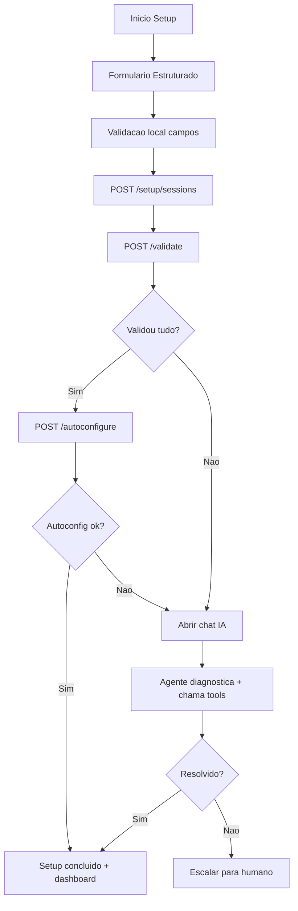
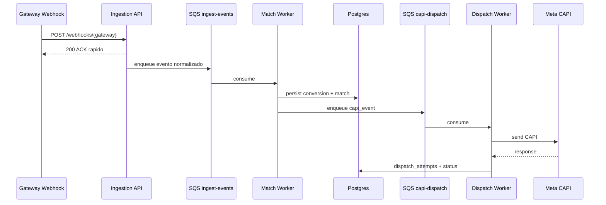
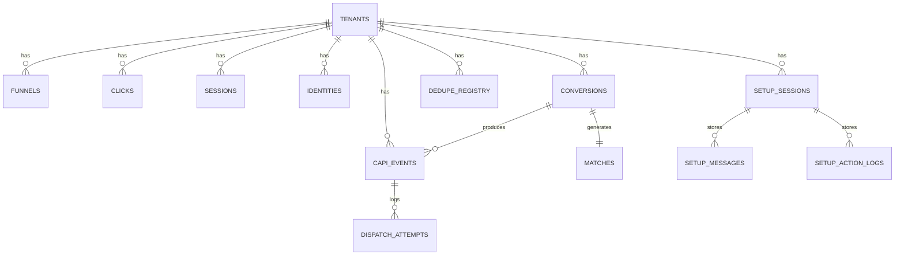

# Whiteboard Blueprint - Hub Server-Side Tracking

## 1. Decisao de Ferramentas (eficiencia)

Escolha recomendada para este projeto:
- Whiteboard tecnico: **Miro**
- Backlog e execucao: **ClickUp**

Motivo pratico:
- Miro e mais forte para diagramacao sistemica (fluxos grandes, frames e canvas livre).
- ClickUp oferece hierarquia nativa para produto/engenharia (Epic -> Story -> Subtask), campos customizados e webhooks maduros para automacao com agentes.

Quando usar Figma/Trello:
- Figma: para UI/prototipos de telas; manter como ferramenta secundaria.
- Trello: somente se o time for pequeno e backlog simplificado; para este produto multi-servicos, tende a escalar pior.

## 2. Integracao dos Agentes (antes do dev)

### 2.1 Agentes -> Miro

Objetivo: o agente criar/atualizar board tecnico automaticamente (frames, sticky notes, cards de decisoes).

Escopo MVP:
- Criar board base por tenant/projeto.
- Criar frames padrao: Contexto, Frontend, API, Workers, Banco, Riscos, Decisoes.
- Publicar snapshots de arquitetura por versao (v0, v1, v2).

Integração tecnica:
- OAuth app no Miro.
- API principal: `/v2/boards`, `/v2/boards/{board_id}/items`, `/items/bulk`.
- Estrategia de sincronizacao: write-through por comando do agente (nao evento em tempo real).

Observacao importante:
- Webhooks experimentais do Miro foram descontinuados em **5 de dezembro de 2025**. Portanto, o padrao mais seguro hoje e sincronizacao ativa via API (polling controlado ou comandos de publicacao).

### 2.2 Agentes -> ClickUp

Objetivo: transformar arquitetura aprovada em backlog executavel, com rastreabilidade.

Escopo MVP:
- Criar Space "Hub Tracking".
- Criar Folders por release (MVP, Hardening, Scale).
- Criar Lists por dominio (Core, Integracoes, Setup Agent, Observabilidade, Compliance).
- Criar tasks (stories) com campos de prioridade, risco, owner, estimativa e dependencia.

Integração tecnica:
- API v2 do ClickUp para tarefas/campos.
- Webhooks para eventos de status (taskCreated, taskUpdated, taskStatusUpdated).
- Assinatura HMAC com `X-Signature` no endpoint receptor.

## 3. Board Visual de Arquitetura (Miro)

## 3.1 Mapa Macro (sistema)

## 3.2 Fluxo Frontend (onboarding + troubleshooting)

## 3.3 Fluxo API/Workers (eventos)

## 3.4 Modelo de dados (ER simplificado)

## 4. Frames obrigatorios no Miro

Crie estes frames no board:
1. Contexto de Produto e Metricas
2. Fluxo Frontend (Wizard + Chat)
3. Contratos de API (Setup + Tracking + Webhooks)
4. Event Pipeline (SQS/Workers)
5. Banco de Dados e idempotencia
6. Setup Agent (tools, guardrails, fallback)
7. Observabilidade e SLOs
8. Riscos e Mitigacoes

## 5. Padrao de contratos de API (resumo)

Setup:
- `POST /api/v1/setup/sessions`
- `POST /api/v1/setup/sessions/{id}/validate`
- `POST /api/v1/setup/sessions/{id}/autoconfigure`
- `GET /api/v1/setup/sessions/{id}/status`
- `POST /api/v1/setup/sessions/{id}/chat`
- `POST /api/v1/setup/sessions/{id}/actions/{tool}`

Tracking:
- `POST /api/v1/track/click`
- `POST /api/v1/track/pageview`
- `POST /api/v1/track/initiate_checkout`

Webhooks:
- `POST /api/v1/webhooks/{gateway}`

Operacao:
- `GET /api/v1/events`
- `GET /api/v1/events/{id}`
- `POST /api/v1/replay/{event_id}`

## 6. Definicao de pronto para iniciar desenvolvimento

Checklist:
- [ ] Board Miro com 8 frames obrigatorios aprovado por produto + engenharia
- [ ] Contratos de API v1 revisados
- [ ] ER simplificado aprovado
- [ ] Regras de dedupe/matching documentadas
- [ ] Backlog MVP criado no ClickUp com owners e dependencias
- [ ] Politica de seguranca e LGPD documentada
